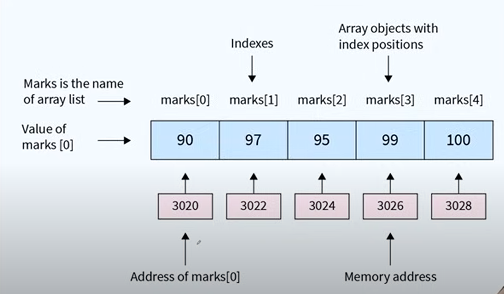

# Chapter 1 Introduction to java 
- why
    - popular
    - wide(web, backend, mobile, enterprice sw)
    - high paying
    - object oriented
    - Rich APIs and community support
- what is programming language
    - natural language to machine language(0/1 or on or off)
    - compiler convert HLL lang to LLL or machine code
- Algorithm - steps of instruction
- syntax - rules of language

### Java

- james Gosling at Sun Microsystems
- Oak -> Java
- Write Once, Run Anywhere (cross-platform compatibility)
- Program -> compiler -> ByteCode -> JVM -> machine compatible code
- backward compatiblity

- Magic of Byte Code
    - Source -> compiler -> output(byte code) -> JVM -> Machine compatible code
- Java Buzzwords
    - Robust : memory mangement, exception handling 
    - Multithreaded : execute multiple threads concurrently
    - Architecture Neutral: bytecode
    - Interpreted and High performance: byte code interpreted by JVM, Just-In time compilation
    - Distributed: network-based application, semaleiss integration to interned

- Object Oriented Programming 
    - class - Human, Hotel
    - object - Name
    - Properties - id, phoneNo, rooms
    - Methods - Job, eat, run, cancelRoom, reserveRoom
- Procedure oriented (functions)

# Chapter 2 Java Basics 

1. Installing JDK
2. first class using text Editor
3. Compiling and Running 
4. Anatomy of a class
5. file Extensions
6. JDK vs JVM vs JRE
7. showing Output
8. Installign IDE
9. Creating first Project

### Flow
    Program.java -> java compiler -> Program.class -> JVM -> Output

### Anatomy of a class

### File Extesions
- .java : java source Code, JLL, editable
- .class : Bytecode, for JVM, execution, not to edit

### JDK vs JVM vs JRE

#### JDK
- .jdk s/w dev kit req to dev java app
- includes JRE, interpreter/loader, compiler(javac), docGenerator(javadoc), ..

#### JRE
- provides lib, JVM, other components to run app
- not have tools and utilities for developers like compiler.

#### JVM
- part of JRE execute bytecode
- not platform-independent, diff JVM for diff machine

### Showing Output
- println -> new line

### Main Method
- Entry point, execution start
- static belong to class no need to creat object to access
- must be public so JVM can access

### IDE (Integrated development Environment)
- Intellij Community Edition
- shift+f10 : run
- shift+f9 : debug
- alt+enter : suggests fix

- out : .class files
- idea : meta files

## Chapter 2 Challenge

1. create a class ot output :good morning using a text editor and check output.
2. Create a new Project in Intelij Idea and output "subscribe" on the console.
3. show the following patterns.

## Chapter 2 Practice Exercise

1. Computers understand HLL like Java, C. false
2. An Algorithm is set of instructions to accomplish a task. true
3. Computer is smart enough to ignore incorrect syntax. false
4. Java was first released in 1992. false
5. java was named over a person who made good coffee. false
6. ByteCode is platform independent. True
7. JDK is a part of JRE. false
8. It's optional to declare main method as public. false
9. class file contains machine code. fasle
10. println adds a new line at the end of the line. true

# Chapter 3 Data Types, Variables and Input 

1. Variables : store Date, name, memory, value
2. Data Types
3. Naming Conventions
4. Literals
5. Keywords
6. Escape Sequences
7. User Input
8. Type Conversion and Casting

### Variable
- Store Data
- name, memory, value
- Memory Allocation
    - Stored in RAM
    - Memory Adderess
    - DataType VarName = Value;

### Data Types

- byte - 8 bit
- short - 2 byte
- int - 4 byte
- long - 9 byte
- char - 2 byte
- float - 4 byte (3.14f)
- double - 8 byte
- boolean - 1bit, either true or false

- defaut value: 0, false

### Naming Conversion
- camelCase (This but class have first letter capital)
- snake_case
- kebab-case
- Keep a Good and short name

- Indentifier - variable name (only _ or $ allowed in special char)

### Literal
- Literal - value of variable

### Keywords
- Keywords - default, switch, char, long, interface, synchronized ....

### Escape Sequence
- escape sequences: \" , \\, \n, \t, \b(backspace)

### User Input
Scanner scanner = new Scanner(System.in)
- creates a new object of Scanner type and give it default input

### Type Conversion

- implicite type conversion / coersion- small to big
- explicit type conversion / casting - big to small (data may loss)

## Chapter 2 Challenges
4. Show the following patterns using single print statement

5. Create a program to input name of the person and respond with "Welcome NAME to KG Coding"
6. Create a program to add two numbers.

## Practice Exercise

1. In Java, a variable's name can start with a number. False
2. char in Java can store a single cahracter. True
3. Class names in Java typically start with a lower case letter. False
4. 100L is a valid long Literal in Java. True
5. \d is an escape sequence in java for a digit cahracter. False
6. Scanner classs is used for reading console input. True
7. In Java, an int can be automatically converted to a byte. False
8. Java variable names are case-sensitive. True
9. Scanner class can be used to read both primitive data types and strings. True
10. Explicit casting is required to convert a double to an int. True

# Chapter 4 Operators, If-else and Number System 
1. Assignment Operator
2. Arithmetic Operators 
3. Order of Operators
4. Shorthand Operators
5. Unary Operators
6. If-else
7. Relational Operators
8. Logical Operators
9. Operator Precendence
10. Intro to Number System
11. Intro to Bitwise Operators

### Assignment Operators
- = : assign value of right to left

### Arithmatic Operators

- +, -, *, /, %

### Order of Operation and operator precedence

- BODMAS

### Shorthand Operators
- += -= *= /= %= <<= >>= >>>= &= ^= |=

### Unary Operator
- ++ -- + - ! ~
- Post and Pre

### if-else
- if(condition){} : if condition is true exicutes the block of code
- if-else ladder

### Relational Operators
- Equality : ==(loose), ===(strict)
- Inequality : != (loose), !== (strict)
- Relational
    - > : Greater than
    - < : Less Than
    - >= : Greater than or equal to
    - <= : Less than or equal to
- order of relational operator is less than arithmetic operators

### Logical Operators

- AND (&&) : all must be true
- OR (||) : one condition must be true
- Not (!) : inverts
- Lower priority than math and comparison operators

### Operator Precedence and Associativity

- Parentheses ()
- Unary ++ -- + - ! ~
- Multiplication/Division/Modulo * / %
- Addition/Subtraction + -
- Shift Operators << >> >>>
- Relational < <= > >= instanceof
- Equality == !=
- Bitwise AND &
- Bitwise XOR ^
- Bitwise OR |
- Logical AND &&
- Logical OR ||
- Ternary ?:
- Assignment = += -= *= /= %= <<= >>= >>>= &= ^= |=

### Intro to Number System
- Binary (2) : 0,1
- Octal (8) : 0,1,2,3,4,5,6,7
- Decimal (10) : 0,1,2,3,4,5,6,7,8,9
- Dexadecimal (16) : 0,1,2,3,4,5,6,7,8,9,A,B,C,D,E,F

- In Decimal  
  $$423 = 4 * 10^2 + 2 * 10^1 + 3 * 10^0$$

- In Binary  
  $$11010.11_2 = 1 * 2^4 + 1 * 2^3 + 0 * 2^2 + 1 * 2^1 + 0 * 2^0 
  + 1 * 2^{-1} + 1 * 2^{-2}$$  

  $$= 16 + 8 + 2 + 0.5 + 0.25 = 26.75_{10}$$

### Intro to Bitwise Operator

- AND (&)
- OR (|)
- XOR (^) : true if both diff
- NOT (~)
- Left Shift (<<) : 0100 -> 1000 (multiply by 2)
- Right Shift (>>) : 1100 -> 0110 (devide by 2)
    - if positive zero filled
    - if negetive one filled

- ~5 = ~(00000101) = 11111010 = 2's compliment of -6.
- if the MSB is 0 then its positive, convert directly.
- if the MSB is 1 then its negetive, find its 2's compliment.

## Chapter 4 Challenges

7. Create a program to swap two numbers.
8. Create a program that takes two numbers and shows result of all arithmetic operators (+,-,*,/,%).
9. Create a program to calculate product of two floating points numbers.
10. Create a program to calculate Perimeter of a rectangle.
11. Create a program to calculate the Area of a Triangle.
12. Create a program to calculate simple interest.
13. Create a program to calculate Compound interest.
14. Create a program to convert Fahrenheit to Celsius.
15. Create a program that determines if a number is positive, negative, or zero.
16. Create a program that determines if a number is odd or even.
17. Create a program that determines the greatest of the three numbers.
18. Create a program that determines if a given year is a leap year, (considering conditions like divisible by 4 but not 100, unless also
divisible by 400).
19. Create a program that calculates grades based on marks

        A -> above 90%      B -> above 75%
        C -> above 60%      D -> above 30%
        F -> below 30%

20. Create a program that categorize a person into different age groups

        Child -> below 13       Teen -> below 20
        Adult -> below 60       Senior-> above 60

21. Create a program that shows bitwise AND of two numbers.
22. Create a program that shows bitwise OR of two numbers.
23. Create a program that shows bitwise XOR of two numbers.
24. Create a program that shows bitwise compliment of a number.
25. Create a program that shows use of left shift operator.
26. Create a program that shows use of right shift operator.
27. Wrtite a program to check if a given number is even or odd using bitwise operators.

## Chapter 4 Practice Exercise

1. In java, && and || operators perform short-circuit evaluation. True
2. In an if-else statement, the else block executes only when the if condition is false. True
3. Java allows an if statement without the else part. True
4. The ^ operator in Java is used for exponentiation. False
5. Unary minus operator can be used to negate the value of a variable in Java. True
6. a += b is equivalent to a = a + b in Java. True
7. In Java, the binary number system uses base 10. False
8. The number 1010 in binary is equivalent to 10 in decimal. True
9. & and | are logical operators in Java. False
10. In Java, a >> 2 shifts the binary bits of a to the left by 2 positions. False

# Chapter 5 Loops, Methods and Arrays

1. Comments
2. While Loop
3. Methods
4. Return statement
5. Arguments
6. Array
7. 2D Array

### Java Comments

- // : single line
- /* */ : multi line
- /** */ : java Docs

### Loops

- Repeated execution of code
- Types : while, for, do-while

### While Loops
- Initialization; -> while(condition){body + Updation}
- repeat while condition true

### Methods / Methods
- block of reusable code
- DRY(Don't repeat yourself)
- camelCase

- Method Syntax

- In general function
- function in class is methods
- static method belong to class no need to make object

### Return Statement
- send value backfrom a function
- return ends the function
- prefer returning local values instead of global values

### Argument and parameters
- parameters -> functions -> return
- Arguments vs parametes
    - Arguments - Actual values that provided to function
    - parametes - values that function received
- multiple parameters
- default parameters

### Arrays

- list of values in single varible of same data type
- Index starts with 0

- Array memory
    
- Array Syntax
    

- out of bound indexing

### 2D Arrays

- 2d : rows and cols
    - Array of and arrays
    - 
    - Hetrogeneous Array
        - {{1, 2, 3}, {4, 5}, {7, 8, 9, 10}}

- 3d : length, breath, height

## Chapter 5 Challenge

28. Develop a program that prints the multiplication table for a given number.
29. Create a program to sum all odd numbers from to to a specified number N.
30. Write a function that calculates the factorial of a given number.
31. Create a program that computes the sum of the digits of an integer.
32. Create a program to find the Least Common Multiple (LCM) of two numbers.
33. Create a prgram to find the Greatest Common Divisor (GCD) of two integers.
34. Create a program to check whether a given number is prime.
35. Create a program to reverse the digits of a number.
36. Create a program to print the fibonacci series up to a certain number.
37. Create a program to check if a number is an Armstrong number.
38. Create a program to verify if a number is a plindrome.
39. Create a program that print patters:
    
40. Create a program to find the sum and average of all elements in an array.
41. Create a program to find number of occurences of and element in and array.
42. Create a program to find the maximum and minimum elements in an array.
43. Create a program to check if the given array is sorted.
44. Create a program to return a new array deleting a specific element.
45. Create a program to reverse and array.
46. Create a program to check is the array is palindrome or not.
47. Create a program to merge two sorted arrays.
48. Create a program to search an element in a 2-D array.
49. Create a program to do sums and average of all elemets in a 2-D array.
50. Create a program to find the sum of two diagonal elements in a 2-D array.

## Chapter 5 Practice Exercise 
1. A 'while' loop in java continues to execute as its condition is true. True
2. The body of a 'while' loop will execute at least once, regardless of teh condition. False
3. A 'while' loop cannot be used for iterating over an array. False
4. Infinite loops are not possible with 'while' loops in java. False
5. A method in java can return more than one value at a time. False
6. It's mandatory for every Java method to have a return type. True
7. The size of an array in java can be modified after it is created. False
8. Arrays in Java can contain elements of different data types. False
9. An array is a reference type in java. True
10. Java arrays are zero-indexed, meaning the first element has an index of 0. True

# Chapter 6 Classes & Objects

1. Process vs Object Oriented
2. Instance Variable and Methods
3. Declaring and Using Objects
4. Class vs Object
5. This & Static keywords
6. conturctors & Code Blocks
7. Stack vs Heap Memory
8. Primitive bs Reference Types
9. Variable Scopes
10. Garbage Collection & Finalize

### Process vs Object Oriented

- Procedural Programming : Execution of a processes by functions.
- OOP : Programming using objects and classes.

### Instance Variable and Methods

### declaring Objects

- new instantiates a new objects of a class
- memory allocation in heap
- calls class constructor to initilize the object
- returns reference
- also used for array creation int[] arr = new int[];
- Dynamic Allocation : allocate memory at runtime.

- syntax

### Using Objects
- access using . operator

### Class vs Objects

- Class is a blueprint
- Objects are real values in memory

### This Keyword
- current instance
- can be used to invoke constructor of the same class (this()).
- Invokes a method of the current object
- pass as argument
- return the current class instance

### Static Keyword

- Static Variable belong to the class, shared among all instances not individual.
- Static method called without creating and object of class. can only access static var and other methods
- static methods can't directly reference non static members.

### Constructors

- initialize new objects and set intial state for object's attributes.
- same name as the class
- no return type (returns object)
- automatically called

- Types of constructor
    - Default : no constructor explicitly defined, java intializes all member variables to default values.
    - Parameterized : parameters to pass values when creting an object

- Constructor Chaining
    
    - this() to call another constructor
    - this() must be first statement
    - can't form a loop, must have termination point

- Code Blocks
    - scope : {}
    - local variable : not accessible outside
    - Initialization Block : run each time an instance is created
    - Static Block run once

### Stack vs Heap Memory

### Primitive and Reference Types

- primitives store actual values, reference types store addresses to objects
- prmitives have specific defaults like 0 or false, reference tupes default to null
- prmitives is generally faster
- primitive stack, reference heap
- compared by value, compared by reference

### Variable Scopes

- Instance variable/ global scoped/variable : accessed thoughout class
- local scoped : accesed inside block

### Garbage Collection and Finalize
- automatic process, managed by JVM
- object eligiblility, no longer reachable
- no manual control, cannot explicitly deallocate memory
- Ganerational collection : divides memory into regions, young, old, permanent generations based on object age
- occurs in heap memory
- can affect application performance

- Finalization : before obj garbage collected, the finalize() may called, give chance to clean up resources, it not guarateed to run and discouraged.
- System.gc(), suggests JVM to perform GC.

## Chapter 6 Challenge

51. Create a Book class for a library system.
    - Instance variable : title, author, isbn.
    - static variable : totalBooks, a couter for the total numer of book instaces.
    - Static method : getTotalBooks(), to get the total number of books in the library.
52. Design a Course class.
    - Instance variable : borrowBooks(), to get the total number of books in the library.
    - Static variable : maxCapicity, the maximum number of students for any course.
    - Instance methods : enrollStudents(String studentName), unenrollStudent(StudentName).
    - Static method : setMaxCapacity(int capacity), to set the maximum capacity for courses.

## Chapter 6 Practice Exercise
1. Object-oriented proframming is mainly concerned with data rather than logic. True
2. Instance methods in Java can be called without creating an object of the class. False
3. A class in Java is a template that can be used to create objects. True
4. Static methods belong to the class and can be called without an object. True
5. The new keyword is used to declare an array in java. True
6. Variables declared within a method are called instance variables. False
7. In Java, you can access instance variables though static methods diretly. False
8. Every object in Java has its own unique set of instatnce variables. True
9. The static keyword in Java means that a particular memeber belongs to a type itself, rather than to instances of that type. True
10. Variable scope in java determined at runtime. False

# Chapter 7 Control Statements, Math & String
1. Ternary operator
2. Switch 
3. Loops (Do-while, for, for each)
4. Using break & continue
5. Recursion
6. Random Numbers & Math class
7. Don't Learn Syntax
8. toString Method
9. String class
10. StringBuffer vs StringBuilder
11. Final keyword

### Ternary Operator
- variable = condition(boolean) ? exp 1 (true) : exp2 (false)
- expression must return compatible types

### Switch 

- Multiple Case
- break prevent fall-through
- default case
- enhance switch
    
- can retun a value using yield

### Loops (Do-while)

1. Exicutes block first, then check condition
2. at least one iteration
3. avoid infinite loop

### Loops (for)

- preferred for couting iterations

### Loops (for each)

- array itereation
- parameters : item, index
- using return is similar to continue in traditional loops
- not straightforward to break out

### using break and continue
- break : stops a loop
- continue : skip one iteration
- in while loop manually update before continually

### Recursion

- function calls itself
- Base condition : to stop recursion
- Stack Overflow risk : excessive recursion can cause stack overflow
- ideal for problems divisible into similar, smaller problems.

### Random Numbers & Math class
- Math methods are static and accessed directly
- constants : includes PI and E for pi and base of natural log.

- Math methods :
    - abs() : Absolute value
    - ceil() : Rounds up
    - floor() : Rounds down
    - round() : rounds to nearest integer
    - max(), min() : max and min of two nums
    - pow() : power
    - sqrt() : square root
    - random() : random double from between 0 and 1
    - exp(), log() : exponential, logarithmic func
    - sin(), cos()... : trignomatric func

### Don't Learn Syntax
- google, oracle docs, chatGPT
- understood concept

### toString Method
- string representation of an object
- inherited from the object class
- return class name, "@", and hashcode
- commonly overrideen in for custom meaningful o/p
- Implicit call while string concatenation

### String Class

- Immutablility
- java maintains pool of strings for efficiency
- comparing : equals() checks value, == checks reference
- concatenation : +, create new string
- methods : length(), substring(), equals(), compareTo(), indexOf()
- being immutable, string can use more memory

- String format

- StringBuffer vs StringBuilder

- Final
- its becomes constant
- for performance optimization
- null safety : final var must be intitialized before the contructor completes

## Chapter 7 Challenges
53. Create a program to find the minimum of two numbers.
54. Create a program to calculate the absolute value of a given integer.
56. Create a program to Based on a student's score, categorize as "High", "Moderate", or "Low" using the ternary operator (eg. High for scores > 80, Moderate for 50-80, Low for < 50)
57. Create a program to pring the month of the year based on a number (1-12) input by the user.
58. Create a program to create a simple calculator that uses a switch statement to perform basic arithmetic operations like addition, substraction, multiplication, and division.
59. Create a program using do-while to find password checker until a valid password is entered.
60. Create a program  using do-while to implement a number guessing game.
61. Create a program using for loop multiplication table for a number.
62. Create a program using for to diaplay if a number is prime or not.
63. Create a program using for-each to find the miximum value in an integer array.
64. Create a program using for-each to find the occurrrences of a specific element in an array.
65. Create a program using break to read inputs from the user in a loop and break the loop if a specific keyword (like "exit") is entered.
66. Create a program using continue to sum all positive numbers entered by the user; skip any negative numbers.
67. Create a program using continue to print only even numbers using continue for odd numbers.
68. Create a program using recursion to display the Fibonacci series upto a certain number.
69. Create a program using recursion to check if a string is a palindrome using recursion.
70. Define a Student class with fields like name and age, and use toString to print student details.
71. Concatenate and Convert: Take two strings, concatenate them, and convert the result to uppercase.
72. Calculate the area and circumference of a circle for a given radius using Math.PI
73. Simulate a dice roll using Math.random() and display the outcome (1 to 6).
74. Create a number guessing game where the program selects a random number, and the user has to guess it.
75. Take an array of words and concatenate them into a single string using StringBuilder.
76. Create an object with final fields and a constructor to initialize them.

## Chapter 7 Practice Exercise
1. The ternary operator in Java can replace certain types of if-else statements. True
2. A switch statement in Java can only test for equality with constants. True
3. The do-while loop will execute at least once even if the condition is false. True
4. A for-each loop in Java is used to iterate over arrays. True
5. The break statement skips the current iteration. False
6. The continue statement exits the loop immediately, reagardless of the condition. False
7. In Java, recursion is a process where a method can call itself directly. True
8. Random numbers genreated by math.random() are inclusive of 0 and 1. False
9. the String class is mutable, meaning it can be cahnged after it's created. False
10. StringBuilder is faster than StringBuffer since it is not synchronized. True
11. A final variable in Java can be assigned a value once and only once. True.